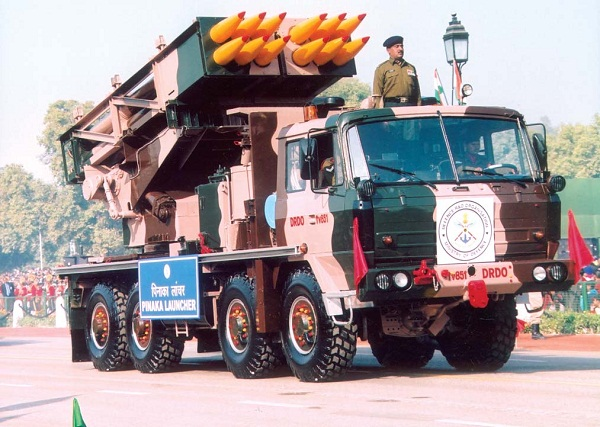
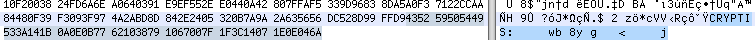

# DRDO CTF 2017 : Crypto-4

**Category:** Crypto

**Level:** Easy

**Points:** 50

**Solves:** 44

**Description:**

>Here is a poem with an image message.<br/>
>Figure out the hints and decrypt the message using a very **basic encryption** mechanism.<br/>
>*it’s a shoRt story, some are haPpy some are sOrry*<br/>
>*If you know you Can fly, don’t ask who am i*<br/>
>*if you kNow it’s Kind of simple, **first even then odd sAmple***<br/>
>*takE a breaK have some minTs, then find what Are hints*<br/>
><br/>

## Write-up

>1. Open image in any hex editior. Last bytes of image are the crypt message of challenge.<br/>
><br/>
>Therefore, CryptMessage is `141B0A0E0B77621038791067007F1F3C14071E0E046A`<br/>
>2. To get the key, you need to understand the given poem. You can easily find that there are some CAPITAL LETTERS in the poem. 
Lets arrange them in the same order as we read the poem. <br/>
>Captial Letters are `RPOICNKAEKTA`<br/>
>3. In the third line of poem there is hint **first even then odd sAmple**. This hint means that we need to first arrange even letters and then odd letter in the string of capital letters. Using this hint will result in the key.<br/>
>Key is `PINAKAROCKET`<br/>
>4. It is mentioned in the challenge statement that a basic encryption is used. Therefore, first choice would be XOR. As we know this time key length(12) is lesser than crypt message(22 bytes), we will repeat the key to match the length with crypt message.<br/>
>Final Key is `PINAKAROCKETPINAKAROCK`<br/>
>5. Now, XOR of final key and the crypt message will result in the flag. <br/>
>6. Flag is : `DRDO@60_{2U3P6Q}_FLAG!`<br/>

## Python Program

```Python
crypt = '141B0A0E0B77621038791067007F1F3C14071E0E046A'.decode('hex')
key = 'PINAKAROCKETPINAKAROCK'
plain_hex = ''.join(hex(ord(a) ^ ord(b))[2:].zfill(2) for a,b in zip(key,crypt))
plain_hex.decode('hex')
#output is : 'DRDO@60_{2U3P6Q}_FLAG!'
```
