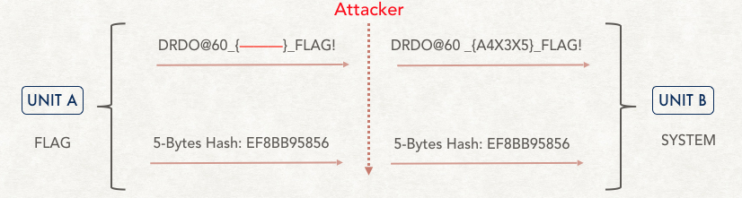

# DRDO CTF 2017 : Crypto-6

**Category:** Crypto

**Level:** Moderate

**Points:** 100

**Solves:** 37

**Description:**

>Unit B captured a system having many classified information. A flag works as a key to that system. <br/>
>Any wrong key can destroy the system without extracting information. Unit A captured the flag and sent to Unit B so that unit B breaks the system immediately. As there was a chance that key can be tampered in between therefore unit A used a hash-like function (for integrity check) which outputs **5 bytes** for any input. <br/>
>Unit A provides the flag as an input to the function (unit B also has this function) and gets a 5 byte output. Unit A sends this 5 byte output to unit B so that unit B can verify that flag received by it was the correct one. In case the 5 bytes mismatch occurs unit B will not use the key and will request to resend the key.<br/>
>But in reality unit A captured the correct flag and sent it to unit B with 5-bytes hash-like output. Unit B received the flag and calculated the 5-byte hash and matched it with the received hash. It matched and unit B inputs the key to the system and surprisingly system destroys. <br/>
>Diagram in the attachment depicts what happened: (Attacker changed **two characters of the flag(X,X) (case not changed)** such that **hash is still valid**) . Go ahead and find the complete flag.<br/>
><br/>
>Details of Hash functions are as follows:<br/>
>Hash Function:<br/>
>```
>1st Byte: Addition/substraction/multiplication of following bytes of input string: 1,6,8,10,12… mod 256
>2nd Byte: Addition/substraction/multiplication of following bytes of input string: 2,7,9,11,13… mod 256
>3rd Byte: Addition/substraction/multiplication of following bytes of input string: 3,8,10,12,14… mod 256
>4th Byte: Addition/substraction/multiplication of following bytes of input string: 4,9,11,13,15… mod 256
>5th Byte: Addition/substraction/multiplication of following bytes of input string: 5,10,12,14,16… mod 256
>```
>Sample Hash Output:<br/>
>```
>String: The Agni ballistic missiles are a range of MRBMs, IRBMs, ICBMs meant for long-range deterrence. Hash: 3EBAD3520
>String: The Trishul is a short range surface-to-air missile developed by India. Hash: BF2C5E7BDA
>String: The Nag Anti-tank missile is a guided missile system intended for the Indian Air Force and the Indian Army. Hash: B45664A72D
>String: The Shaurya missile is a canister-launched hypersonic surface-to-surface tactical missile developed by DRDO. Hash: 54C7FD1E76
>String: The K-15 Sagarika is a nuclear-capable submarine-launched ballistic missile with a range of 750 kilometres. Hash: FE1CE2A393
>```


## Write-up

>1. The challenge descibe a hash function which doesn't fullfil requirement and produces same hash for different input. <br/>
>2. In the challenge statement partial flag is given, which is `DRDO@60_{A4X3X5}_FLAG!`, and missing two positions which are `X` needs to be find to get the complete flag.<br/>
>3. It is clear in the challenge statement that `X` positions have been changed and case not changed(it means only UPPERCASE are valid becase `X` is in uppercase). That means those two `X` must be replaced by any uppercase character from `A` to `Z`.<br/>
>4. Now you have to find out what is hash function. As mentioned in the statement that hash function is a combination of addition/substraction/multiplication and there is specfic way to find everybyte of hash. (Some of participants got confuesd that operations used in hashfunction are different for each byte but then it was cleared that hash function operations are same of each byte)<br/>
>We can rewrite the hash function(Hash(x<sub>1</sub>,x<sub>2</sub>,x<sub>3</sub>,...); x<sub>i</sub> is i<sup>th</sup> byte of string `x`) as follows:<br/>
>Lets assument any input string `s`, then<br/>
>>1 <sup>st</sup> Byte of Hash : Hash(s<sub>1</sub>,s<sub>6</sub>,s<sub>8</sub>,...) mod `256`<br/>
>>2 <sup>nd</sup> Byte of Hash : Hash(s<sub>2</sub>,s<sub>7</sub>,s<sub>9</sub>,...) mod `256`<br/>
>>3 <sup>rd</sup> Byte of Hash : Hash(s<sub>3</sub>,s<sub>8</sub>,s<sub>10</sub>,...) mod `256`<br/>
>>4 <sup>th</sup> Byte of Hash : Hash(s<sub>4</sub>,s<sub>9</sub>,s<sub>11</sub>,...) mod `256`<br/>
>>5 <sup>th</sup> Byte of Hash : Hash(s<sub>5</sub>,s<sub>10</sub>,s<sub>12</sub>,...) mod `256`<br/>
Now to find the Hash() you need to take help of given sample input strings and output hashes. If analysed properly you will find Hash() is just an addition operator. So, you can replace Hash() with Add().<br/>
>5. Now you have figured it out that hash is just addition of given bytes then modulo 256. Now you have to examine the parital flag given to you. <br/>
>Partial Flag is : `DRDO@60_{A4X3X5}_FLAG!` <br/>
>If you examine closely both `X` are alternate to each other that means while calculating the hash function either both `X` will use used or no `X` will be used because of propertly of hash bytes specified in challenge statement. <br/>
>Decimal(ASCII) value of `X` is `88` and while calculating the `X` + `X` = `176`. Now you need to find two characters from `A` to `Z` such that addition of ASCII decimal of both characters gives `176`. <br/>
>You can easily verify that only options are:<br/>
>>* (W,Y) : `87` + `89` = `176`<br/>
>>* (Y,W) : `89` + `87` = `176`<br/>
>>* (V,Z) : `86` + `90` = `176`<br/>
>>* (Z,V) : `90` + `86` = `176`<br/><br/>
You have 5 chances to verify correct pair and you have only 4 options. You need to submit the flag and check each option.<br/>
>6. Flag is : `DRDO@60_{A4Z3V5}_FLAG!`<br/>

## Python Program

```Python
#Hash Function

input_string = "DRDO@60_{A4Z3V5}_FLAG!"
#for i in range(0,len(input_string)):
#    print "Integer Value for " + str(i) + " Character " + input_string[i]  + " is " + str(ord(input_string[i])) + "\n"
first_byte = ord(input_string[0])
for i in range(5,len(input_string),2):
    first_byte = first_byte + ord(input_string[i])

second_byte = ord(input_string[1])
for i in range(6,len(input_string),2):
    second_byte = second_byte + ord(input_string[i])
    
third_byte = ord(input_string[2])
for i in range(7,len(input_string),2):
    third_byte = third_byte + ord(input_string[i])
    
forth_byte = ord(input_string[3])
for i in range(8,len(input_string),2):
    forth_byte = forth_byte + ord(input_string[i])
    
fifth_byte = ord(input_string[4])
for i in range(9,len(input_string),2):
    fifth_byte = fifth_byte + ord(input_string[i])

Hash = str(hex(first_byte%256))[2:] + str(hex(second_byte%256))[2:] + str(hex(third_byte%256))[2:] + str(hex(forth_byte%256))[2:] + str(hex(fifth_byte%256))[2:]
print "5-Byte Hash of input string is: " + Hash
#output is : ef8bb95856
```
