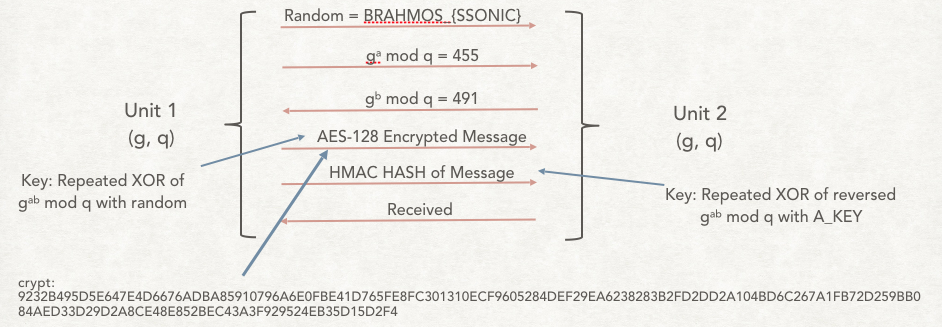

# DRDO CTF 2017 : Crypto-7

**Category:** Crypto

**Level:** Hard

**Points:** 200

**Solves:** 22

**Description:**

>Two army units want to communicate to each other and need a system to provide confidentiality, integrity and authentication. A **Diffie-Hellman key exchange** based system has been designed to meet the requirements. <br/><br/>
>The mechanism is explained in the attached diagram using a sample communication.<br/>
><br/>
>AES-crypt in the given Image is:<br/>
>`9232B495D5E647E4D6676ADBA85910796A6E0FBE41D765FE8FC301310ECF9605284DEF29EA6238283B2FD2DD2A104BD6C267A1FB72D259BB084AED33D29D2A8CE48E852BEC43A3F929524EB35D15D2F4`<br/>
>Although system was secure but due to use of weak parameters it is possible to break the system. Analysis of system revealed following weaknesses:<br/>
>>1. `Generator g<25 and 400<q<700`<br/>
>>2. `100 < a , b < 1500 and a + b = 2298`<br/>

>You have to break sample encryption and authentication system to capture the flag. Move ahead **Step by Step**.<br/>


## Write-up

>1. As mentioned in challenge statement, Diffie-hellman key exchange mechanism is used here. Serect in DH is g<sup>(ab)</sup> which can only be known if `a` and `b` are known to both parites. `a` and `b` are never exchanged in DH and only g<sup>a</sup>, g<sup>b</sup> are exchanged. <br/>
>2. First step would be to find the secret value which is g<sup>(ab)</sup>. To find it following condition are given in challenge.<br/>
>>* `Generator g<25 and 400<q<700`<br/>
>>* `100 < a , b < 1500 and a + b = 2298`<br/>

>Now we need to bruteforce for the value of a and b to find g<sup>(ab)</sup>. <br/>
>While writing the bruteforce it can be observed that both `a,b >= 799` because to achieve the addition `2298` if one    parameter is maximum `1499` then other has to minimum `799`. <br/>
>   Therfore second codition could be modified to `798 < a , b < 1500 and a + b = 2298`<br/>
>   If you bruteforce in the given range of values you will find follwing set of parameter satisfying the mentioned conditions.<br/>

>|Sl|g|q|a|b|g<sup>(ab)</sup> mod q|
>| ----:|:---------:| -----:|----:|----:|----:|
>|1|23|654|827|1471|329|
>|2|23|654|863|1435|329|
>|3|23|654|899|1399|329|
>|4|23|654|935|1363|329|
>|5|23|654|971|1327|329|
>|6|23|654|1007|1291|329|
>|7|23|654|1115|1183|329|
>|8|23|654|1151|1147|329|
>|9|23|654|1187|1111|329|
>|10|23|654|1223|1075|329|
>|11|23|654|1259|1039|329|
>|12|23|654|1295|1003|329|
>|13|23|654|1331|967|329|
>|14|23|654|1367|931|329|
>|15|23|654|1403|895|329|
>|16|23|654|1439|859|329|
>|17|23|654|1475|823|329|
<br/>
   You can observe that whatever the value of a and b, g<sup>(ab)</sup> mod q is same which is `329` and this is our secret value.<br/>

3. Now you need to XOR `329` with random `BRAHMOS_{SSNOIC}`. To do that you need to find hex of `329`, which is `0149`(two bytes) and XOR with every two bytes of given random. The output will be the key for AES-128 decryption.<br/>

   XOR will output: `431b40014c0652167a1a52064f004234` which is also the key for AES-128 decryption<br/>

   Now decrypt the given crypt using above key for AES-128 and all `00` IV (If not specified you should use IV all `00`)<br/>

   Decryption will output: `FLAG IS IN HMAC PROCESS|A_KEY:1B951B881FF16F9824F10AF41EF008BA0081138618E6||||||`<br/>

   The decrption give the hint that **flag is in the process of HMAC** (some participants confused it with 'Flag is in HMAC').<br/>

   **A\_KEY will be used to derive HMAC key which will be used for HMAC calculations.**<br/>

4. Now to proceed with HMAC we need to find HMAC key which is derived from A\_KEY as mentioned in the diagram.
You need to reverse the secret(`329`) which will be `923` and XOR hex of `923`(039b) with given random `BRAHMOS_{SSNOIC}`. 
The output will be HMAC key which will be used for furhter calucaltions.<br/>

   XOR will output: `180e18131c6a6c03276a096f1d6b0b21031a101d1b7d` which is HMAC Key<br/>

5. Now as the hint was given that flag is in HMAC process, it means we need to obsever HMAC process.<br/>

   <br/>

   It is clear from above diagram that they HMAC key is XORed with two fixed byte arrays called o\_pad and i\_pad. Lets try  the first one which is o\_pad. <br/>

   o\_pad is `5c5c5c5c5c5c5c5c5c5c5c5c5c5c5c5c5c5c5c5c5c5c` <br/>
   HAMC Key is `180e18131c6a6c03276a096f1d6b0b21031a101d1b7d`<br/>

   XOR will output `464c41475f7b593442354e317d5f4341505455524544` which is `DRDO@60_{6U3A7W}_FLAG!`<br/>

5. Flag is `DRDO@60_{6U3A7W}_FLAG!`<br/>

 ## Python Program
 ```Python
 
 # To brute force a,b
 for g in range(2,25):
    print "\ng is: " + str(g) + "\n"
    for q in range(401,700):
        #print "q is: " + str(q)
        for a in range(798,1500):
            for b in range(798,1500):
                if (a+b == 2298 and pow(g,a)%q == 455 and pow(g,b)%q == 491):
                    print "g is: " + str(g) +" q is: "+ str(q) + " a is: " + str(a) + " b is: " + str(b) +"\n"
                    print "Secret is: " + str(pow(g,a*b)%q) + "\n"
 
#g^ab mod q = 329 and hex is 0149
#revese of g^ab mod q = 923 and hex is 039b

# To find AES-Key
key_init = "01490149014901490149014901490149".decode('hex')
random = "BRAHMOS_{SSONIC}"

key_AES = ''.join(hex(ord(a) ^ ord(b))[2:].zfill(2) for a,b in zip(key_init,random))

# To Decrypt AES encrypted message
from Crypto.Cipher import AES
decryption_suite = AES.new(bytes(bytearray.fromhex(key_AES)), AES.MODE_CBC, 16 * '\x00')
crypt = "9232B495D5E647E4D6676ADBA85910796A6E0FBE41D765FE8FC301310ECF9605284DEF29EA6238283B2FD2DD2A104BD6C267A1FB72D259BB084AED33D29D2A8CE48E852BEC43A3F929524EB35D15D2F4"
decryption_suite.decrypt(bytes(bytearray.fromhex(crypt)))

# output is : FLAG IS IN HMAC PROCESS|A_KEY:1B951B881FF16F9824F10AF41EF008BA0081138618E6||||||

# To find HMAC Key using A_KEY
key_reverse = "039b039b039b039b039b039b039b039b039b039b039b".decode('hex')
A_KEY = "1B951B881FF16F9824F10AF41EF008BA0081138618E6".decode('hex')
key_HMAC_hex = ''.join(hex(ord(a) ^ ord(b))[2:].zfill(2) for a,b in zip(key_reverse,A_KEY))

# Going into first step of HMAC reveals the flag
o_pad = "5c5c5c5c5c5c5c5c5c5c5c5c5c5c5c5c5c5c5c5c5c5c".decode('hex')
flag = ''.join(hex(ord(a) ^ ord(b))[2:].zfill(2) for a,b in zip(o_pad,key_HMAC_hex.decode('hex')))
flag.decode('hex')
#output is 'DRDO@60_{6U3A7W}_FLAG!'

 ```
 
