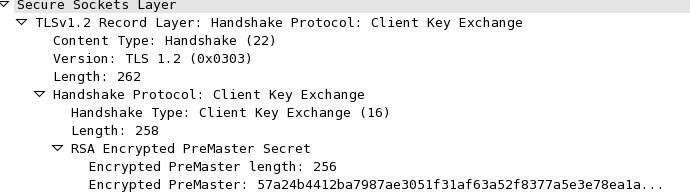
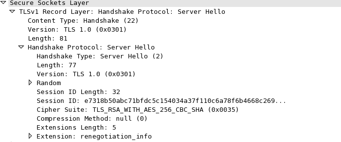

# DRDO CTF 2017 : Crypto-9

**Category:** Crypto

**Level:** Hard

**Points:** 200

**Solves:** 1

**Description:**

Early CCS or CCS Injection is a vulnerability which was discovered in OpenSSL in 2014. This vulnerability allows the server to accept the ChangeCipherSpec message (This message is used to inform that all message following this message are going to be encrypted) of TLS protocol earlier(before ClientKeyExchange message) than expected. 
Due to its early acceptance of CCS message **keys are not exchanged but encryption starts** and client sends an encrypted ClientKeyExchange message. This encrypted ClientKeyExchange message is similar to plain ClientKeyExchange message but it is encrypted due to early acceptance of CCS message. 
ClientKeyExchnage message contains an **encrypted PreMasterSecret which is encrypted using RSA-2048 public key**. Decrypt the contents to attached file of capture the FLAG.

**Hint:** You have to get the PreMasterSecret to capture the FLAG. 

## Additional Information

* TLS Version: 1.0
* Server Private key: cyber\_challenge.key
* PCAP: DecryptMe.pcapng
* Key\_Block.JPG, Master\_Secret.JPG, PRF\_Phash.JPG and rfc2246.txt will help you to understand the protocol and decrypt the content.


## Help
* In wireshark to see the captured packets as TLS message for port 1024:

Go to Wireshark->Analyze tab --> Decode As --> type port 1024 and select SSL protocol. Now it will show packets as SSL/TLS Messages from the port 1024

## Online Resources

* Internet Search: “CCS Injection”, CVE-2014-0224
* TLS 1.0 RFC: https://www.ietf.org/rfc/rfc2246.txt

## Attachments

[DecryptMe.pcapng](DecryptMe.pcapng)

[cyber\_challenge.key](cyber\_challenge.key)

[rfc2246.txt](rfc2246.txt)


## Write-up

1. This challenges was more focused on implementing the given process rather than finding the process. It was clearly mentioned that the traffic given was affected by early CCS and due to which ClientKeyExchange handshake message got encrypted . Therefore, the task was to decrypt the ClientKeyExchange message and get the RSA encrypted PreMasterSecret and then decrypt it using given RSA private Key.

2. **For those who doesn't know about TLS:** 

(You can refer to http://blog.catchpoint.com/2017/05/12/dissecting-tls-using-wireshark/ for summary)

* TLS is `Transport Layer Secryity` which is used world wide to provide secure communication between the devices. Internet is one of the major infrastructure which uses the TLS. All `https` connections use TLS protocol. SSL `Secure Socket Layer` was predecessor of TLS. TLS started with version 1.0 and then upgraded to 1.1 and then to 1.2. TLS 1.3 is still in draft but has been already implemented by most of the libraries. 

* TLS communication can be divided in two parts. First part is handsahke where both the parties agree on common available parameters like KeyExchangeMechanim, DataEncryptionAlgorithm, HashFunction etc. Once both parties agrees and exchange required paramters, encrypted commuincation starts.

   Following Diagram depicts the hanshake process:


* You can see in the daigram that except `Finish` message, all messages of handshake are in plain. Data encrption starts when
`Finish` message exchange is complete. 

* `ClientKeyExchange` contains a valuale information, called `PreMasterSecret`, which is a secret parameter sent from client to the server. To ensure the secrecy `PreMasterSecret` is encrypted with RSA public key and sent to the server. 

Following diagram shows a general structure of `ClientKeyExchange` message for RSA based KeyExchange. 



   You can see that `PreMasterSecret` is encrypted with RSA public key.
  
3. Most important part of complete challenge was to understand what happens when EarlyCCS happens.

* You must refer to https://www.imperialviolet.org/2014/06/05/earlyccs.html for more details.

   When EarlyCCS happens, `KeyBlock` is generated before `MasterSecret` is generate. As you can see in Key\_Block.JPG that to  generate `KeyBlock` , `MasterSecret`  is a necessary paramter. 

   Therefore, **when `KeyBlock` is generated beforehand, value of `MasterSecret` will be `NULL`(hex is `00`)**.  

4. Once you have found that `MasterSecret` is `NULL`, you have to just implement the given process using Key\_Block.JPG, and PRF\_Phash.JPG. Inclusion of repeated HMAC in the process may create difficulty in implementation but it is not difficult if programmed step by step. 

5. After getting `KeyBlock` using `MasterSecret`,`ClientRandom` and `ServerRandom`, you need to extract Key,IV and MAC part from `KeyBlock` as decribed in Key\_Block.JPG.

6. Once you have the key and IV value, you can check that encryption algorithm is `AES-256-CBC` as mentioned in `ServerHello` message(in the image below). Now you just have to decrypt the encrypted `ClientKeyExchange` using `AES-256-CBC`. 



7. After decrypting encrypted `ClientKeyExchange`, you will get the plain `ClientKeyExchange` with similar structure we have mentioned in step 2. From there you can extract encrypted `PreMasterSecret` and decrypt it using given RSA private key called `cyber_challenge.key`.

   `PreMasterSecret`(hex) is : `000301212121594f555f484156455f464f554e445f49542121214452444f4036305f7b48375a3330517d5f464c414721`
   
   `PreMasterSecret`(Plain) is : `!!!YOU_HAVE_FOUND_IT!!!DRDO@60_{H7Z30Q}_FLAG!`

## Python Program

```Python
from Crypto.Hash import SHA
from Crypto.Hash import MD5
from Crypto.Hash import HMAC
from Crypto.Cipher import AES


MAC_LENGTH = 20
KEY_LENGTH = 32
IV_LENGTH = 16
REQ_BYTES = 2*(MAC_LENGTH + KEY_LENGTH + IV_LENGTH)
sha = SHA.new()
md5 = MD5.new()

#Master Secret is NULL
secret = ""
#Client Random
CR = '5a3ce1a2d433af3c614200e126cd441e41175c0a0a8ca28590913857c208b156'
#Server Random
SR = '5a3ce1aba7e58f1d92127509584974fc3e3c3990b792afa9335955052298028d'

seed = bytes(bytearray.fromhex(SR+CR))
label = bytes(bytearray.fromhex('6b657920657870616e73696f6e')) #"key expansion"

output_sha = ''
output_md5 = ''
A_0 = label + seed 
A_old = A_0 

while(len(output_md5)/2 < REQ_BYTES):
    A_new = HMAC.new(secret[0:24],A_old,md5)
    HMAC_md5 = HMAC.new(secret[0:24], bytes(bytearray.fromhex(A_new.hexdigest())) + A_0,md5)
    output_md5 = output_md5 + HMAC_md5.hexdigest()
    A_old = bytes(bytearray.fromhex(A_new.hexdigest()))

A_old = A_0     
while(len(output_sha)/2 < REQ_BYTES):
    A_new = HMAC.new(secret[24:48],A_old,sha)
    HMAC_sha = HMAC.new(secret[24:48], bytes(bytearray.fromhex(A_new.hexdigest())) + A_0,sha)
    output_sha = output_sha + HMAC_sha.hexdigest()
    A_old = bytes(bytearray.fromhex(A_new.hexdigest()))

output_hex = [ hex(int('0x'+output_md5[i:i+2],16) ^ int('0x'+output_sha[i:i+2],16))   for i in range(0,REQ_BYTES*2,2)]

output_string = [x[2:] for x in output_hex]

for i in range(0,len(output_string)):
    if len(output_string[i])==1:
        output_string[i] = '0'+ output_string[i]
#print output_string        
output = ''.join(output_string)
print "Key Material is => " + output[0:REQ_BYTES*2]

Client_MAC = output[:MAC_LENGTH*2]
print "Client MAC=>  " + Client_MAC + "\n"
output  = output[MAC_LENGTH*2:]
Server_MAC = output[:MAC_LENGTH*2]
print "Server MAC=>  " + Server_MAC + "\n"
output  = output[MAC_LENGTH*2:]
Client_KEY = output[:KEY_LENGTH*2]
print "Client KEY=>  " + Client_KEY + "\n"
output  = output[KEY_LENGTH*2:]
Server_KEY = output[:KEY_LENGTH*2]
print "Server KEY=>  " + Server_KEY + "\n"
output  = output[KEY_LENGTH*2:]
Client_IV = output[:IV_LENGTH*2]
print "Cleint IV=>  " + Client_IV + "\n"
output  = output[IV_LENGTH*2:]
Server_IV = output[:IV_LENGTH*2]
print "Server IV=>  " + Server_IV + "\n"

decryption_suite = AES.new(bytes(bytearray.fromhex(Client_KEY)), AES.MODE_CBC, bytes(bytearray.fromhex(Client_IV)))

# Encrypted ClientKeyExchange
cipher_text = bytes(bytearray.fromhex('b00bd34c526d9664854188d0097d394971fc2b585e6ed749482f1d61c05c8e40481f00d07e3ec4450766fe8e8319ff0b1138ee0a3e6f55a7a5652e86380b6a2728e0bfdf7c232b39b5e30cb7e0cd62ff4434a7d29d3cc00d24761b2bc819e676b72c0ed72ae8d7ad781e25b1a9e551e37eb28c05c595842fffe0f71aa2b05c3d39779e5943c74cb6a2b3704dd6a27f46f1a9834c9d500524960b786810166911735da54267cf9afabae6fa9d40ce09ac6bb84dbdf5877111d0ad4b10a3b1e5502cfc9a7b6c33a53a333979df0768aabeb68ff4a5593e78219a86cd98c629c79109447f23de1f9badf1ab62943aea1e65294622ca256996ec437dbc444749e385eeb66d5f2ae4de8d3fa5c8bb6960285704ff39f7d92b01a2b8ea80c891f335df'))

plain_text = decryption_suite.decrypt(cipher_text)

print "Decrypted ClientKeyExchange is: " + plain_text.encode('hex')
print "Encrypted PMS is: "+ plain_text.encode('hex')[12:-52]

from Crypto.PublicKey import RSA
f = open('cyber_challenge.key','r')
key = RSA.importKey(f.read())

enc_pms = plain_text.encode('hex')[12:-52]
dec_pms=key.decrypt(bytes(bytearray.fromhex(enc_pms)))
#print dec_pms
print "Hex of Decrypted PMS is: " + dec_pms.encode('hex')
print "Decrypted PMS is: " + dec_pms.encode('hex')[-96:]
print "Flag is: "+ dec_pms[-46:]
#output is : Flag is: !!!YOU_HAVE_FOUND_IT!!!DRDO@60_{H7Z30Q}_FLAG!
```
