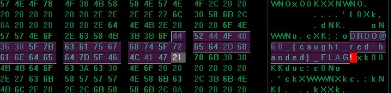

# DRDO CTF 2017 : Forensic-1

**Category:** Forensics

**Level:** Easy

**Points:** 50

**Solves:** 121

**Description:**

A thief tried his little attempt to hide the flag in the disk. Can you find it?

[disk.img](disk.img)

## Write-up

1. Open `disk.img` in any hex editor. (https://sourceforge.net/projects/hexplorer/)

2. Search of `FLAG` (hex is : `0x464C4147`) in the hex data.

There are 3 occurance of `FLAG` and one of the occurance is `DRDO@60_{caught_red-handed}_FLAG!`.

3. Flag is : `DRDO@60_{caught_red-handed}_FLAG!`
