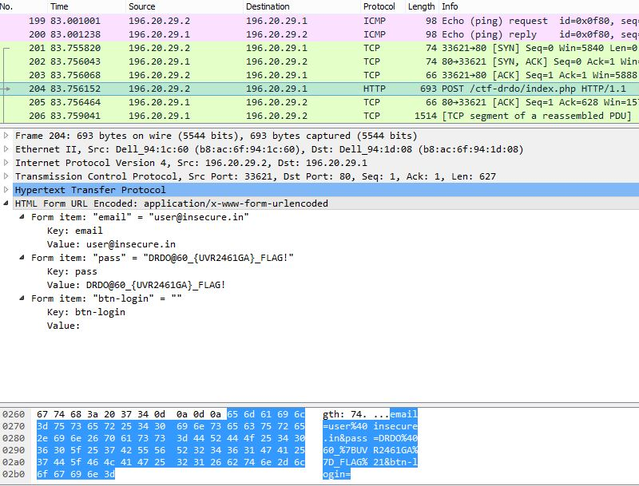

# DRDO CTF 2017 : Network-1

**Category:** Network

**Level:** Easy

**Points:** 50

**Solves:** 198

**Description:**

A hacker has captured insecure network traffic, which contains authentication data from one user. 
Hacker is relatively inexperienced in network traffic analysis. Please help him in finding the password.

[dump.pcap](dump.pcap)

## Write-up

1. Opem `dump.pcap` file in wireshark (https://www.wireshark.org/). 

2. Go to packet No. 204 and you will HTTP POST request which contains the password

3. Flag is : `DRDO@60_{UVR2461GA}_FLAG!`
