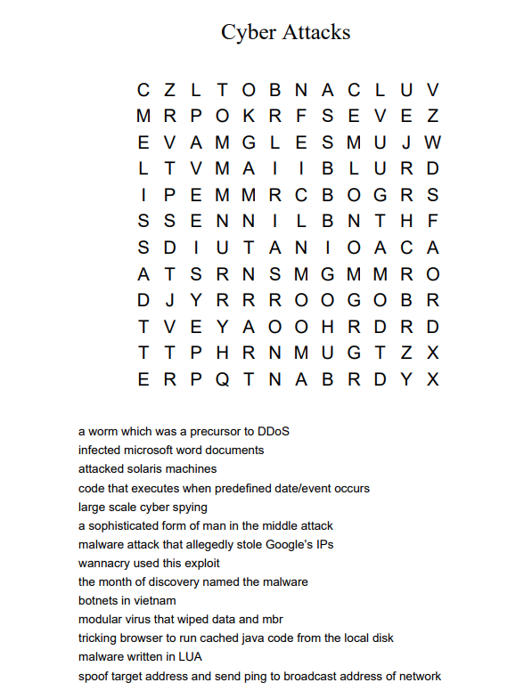

# DRDO CTF 2017 : Puzzle-1

**Category:** Puzzle

**Level:** Easy

**Points:** 50

**Solves:** 88

**Description:**

Solve this puzzle as per the clues.

Flag is `DRDO@60_{XXXXXXXXXXXXXX}_FLAG!`
where the 14-lettered string between braces is formed by the fourth letter of each answer (all in **upper case**) in the same order as the clues.

[CrossWordPuzzle.pdf](CrossWordPuzzle.pdf)

## Write-up

