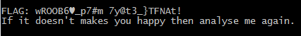
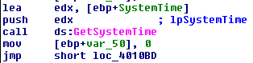
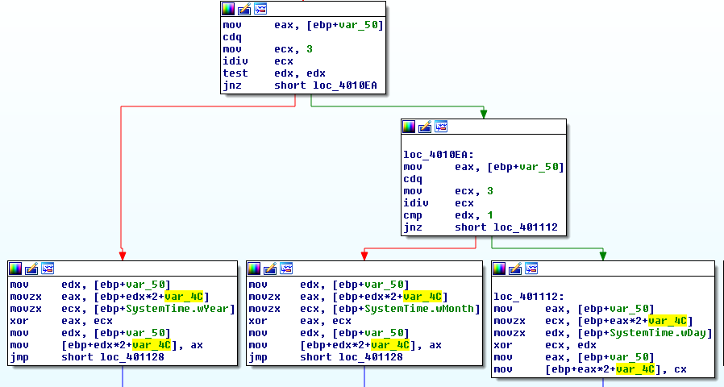

# DRDO CTF 2017 : ReverseEngg-1

**Category:** Reverse Engineering

**Level:** Easy

**Points:** 50

**Solves:** 57

**Description:**

Memories of past time make us happy but it is not possible to go back in past. Here you have the opportunity to find out what time makes you happy.

Hint: An important date related to the person who held the highest position with simplicity and motivated us to work for the nation.

[TimeTravel.exe](TimeTravel.exe)

## Write-up
In general, RE challenges ask for a user-input, and based on the user input displays the flag. This challenge can be a bit unintuitive at first, as it does not ask for any user input, neither it accepts any command-line input. If we execute the binary, it prints some junk characters in the `FLAG` field.



Now, if we open the challenge binary in IDA we can see a call to `GetSystemTime` API. 



So, we can assume that it reads current system time and performs some operations to display the correct flag. The hints given in the problem statement and the name of the challenge also re-inforces our assumptions.



The above disassembly clearly shows the flag calculation. The hex values are stored in stack starting from `var_4c`. The calculation happens inside a loop, where `var_50` is the loop counter. First the value 3 is moved to `ECX`, then `ECX` is divided with the counter, which gives the value of remainder in `EDX`. If the value of the remainder is 0, then `wYear` is used for XOR. If the remainder value is 1, then `wMonth` is used for XOR and if the remainder value is 2, then `wDay` is used for XOR. Also keep in mind the value of *wYear, wMonth and wDay* is 2 bytes each. The logic of the challenge binary can be translated into the following python program.

```python
flag_chars = ['D', 'R', 'D', 'O', '@', '6']

# The following values can be obtained from binary
enc = [0x5596, 0x4f43, 0x3659]#, 0x58e2, 0x377c, 0x6d38, 0x30e1, 0x4075, 0x336f, 0x7abe, 0x4658, 0x4155, 0x2695]

for i in range(0, 3):
	flag_val = (ord(flag_chars[i*2 + 1]) << 8) + ord(flag_chars[i*2])
	if (i % 3) == 0:
		print "Year: ",
	if (i % 3) == 1:
		print "Month: ",
	if (i % 3) == 2:
		print "Day: ",
	print flag_val ^ enc[i]

# OUTPUT
# Year: 2002
# Month: 7
# Day: 25
```
If we set the correct Year, Month and Day in the system and execute the challenge binary again, we will get the correct flag.
```
FLAG: DRDO@60_{7!m37r@v3l}_FLAG!
```
