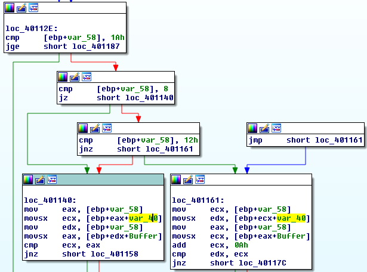

# DRDO CTF 2017 : ReverseEngg-2

**Category:** Reverse Engineering

**Level:** Easy

**Points:** 50

**Solves:** 51

**Description:**

Troops captured a communication system of enemy but access is granted only to the authenticated users. It is urgent to get the access of the system to intercept enemy's communication, but no one knows the secret code. As it is a offline system secret code should be inside it. But where? Help the troops to get access. If you get access, you get the FLAG.

## Write-up

In this challenge let's start from backwards. 


In IDA we can see that the program checks if `var_44` is 1, then only it prints the message *"Congratulation! ACCESS GRANTED..."*. The value of `var_44` is initialized to 1 at the starting of the program, so we need to find where else `var_44` is overwritten by some other value. 


We can see there are 2 basic blocks where `var_44` is overwritten by 0. So, let's analyze the code which leads to these basic blocks.



The above basic blocks are executed inside a loop. Here, `var_58` is the counter of the loop and `var_40` contains stored values in the program. We can observe there are two conditions. If the value of the counter is 0x8 or 0x12, then the user-input is directly compared with the stored value. For other values of the counter the input value is added to 0xA and then compared to the stored value. The logic of the challenge binary can be translated to the following Python code:

```python
# The following values can be obtained from the challenge binary
enc = [0x4e, 0x5c, 0x4e, 0x59, 0x4a, 0x40, 0x3a, 0x69, 0x7b, 0x4d, 0x4a, 0x75, 0x3d, 0x69, 0x61, 0x4a, 0x3b, 0x75, 0x7d, 0x69, 0x50, 0x56, 0x4b, 0x51, 0x2b, 0xa]

for i in range(0,len(enc)):
	if i == 8 or i == 18:
		plain = chr(enc[i])
	else:
		plain = chr(enc[i] - 10)
	print plain,

# OUTPUT:
# DRDO@60_{C@k3_W@1k}_FLAG!
```

`FLAG: DRDO@60_{C@k3_W@1k}_FLAG!`
