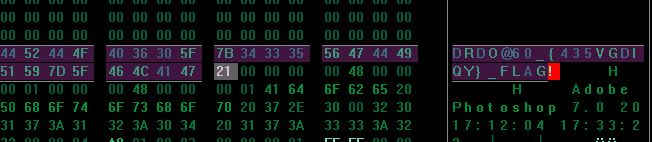

# DRDO CTF 2017 : Stego-1

**Category:** Steganography

**Level:** Easy

**Points:** 50

**Solves:** 185

**Description:**

An image (hidden.jpg) contains some useful information. You can find it by viewing differently and remembering that everything is in the title.

## Write-up

1. Open the image with any hex editor. (https://sourceforge.net/projects/hexplorer/)

2. Scroll down a little and after sequence of may `00` you will find the string `DRDO@60_{435VGDIQY}_FLAG!`

3. Flag is : `DRDO@60_{435VGDIQY}_FLAG!`
