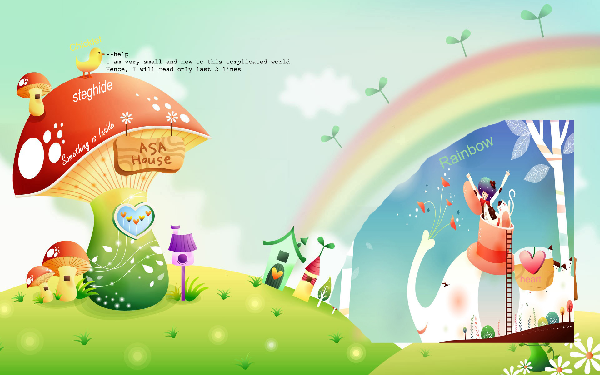

# DRDO CTF 2017 : Stego-2

**Category:** Steganography

**Level:** Moderate

**Points:** 100

**Solves:** 92

**Description:**

An image (stg.jpg) is captured, it contains some message, a clever code breaker looks again and again at the image and finds the clue to retrieve the message.

## Write-up

1. This challenge would require you to use steghide which is a command line tool (http://steghide.sourceforge.net/download.php)

2. Download the file and then launch steghide on the Command prompt using the command "steghide" from the exact file location where steghide is downloaded.

/*Image to be included steg 1.png*/

3. The command to extract files is as follows
            $ steghide --extract -sf stg.jpg
4. You can include the -p or --passphrase if you know the password already.

*Image to be included steg 2.png*/

5. Since we have to guess it, we will execute the command.

6. It will ask for the passphrase. Now open the image (stg.jpg)

7. Trying out all possible combination of words from the image we finally find that the passphrase is "ASA House" (make sure to use the correct case and also whitespace)

*Image to be included steg 3.png*/

8. Now if the password is correct a file called flag.txt will be created for you in the same directory where steghide is present.

*Image to be included steg 4.png*/

9. Open the flag.txt and the flag is present. A message saying 
            Congratulations !!!
            You have got the flag
            DRDO@60_{X0M9L36Z3}_FLAG!
            
